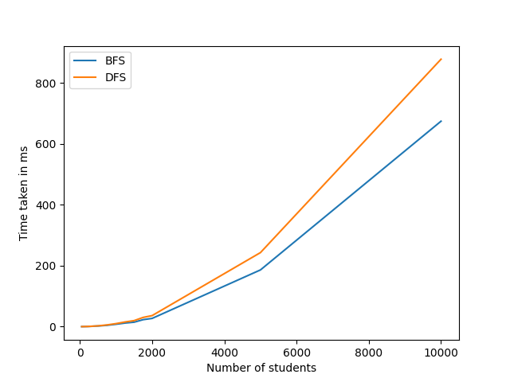

# Friend Recommendations using Graph Traversal Algorithms

For this project, we will be creating a Friend Recommendation system using various graph traversal algorithms. Such a system is common in social media websites like Facebook and Instagram. We will build a network graph using synthetic data and apply Breath First Search and Depth First Search on the network graph.

## Generating the dataset
Use the script `generate_students.py` to generate a list of univeristy students in the Boston area. The python package [Faker](https://faker.readthedocs.io/en/master/) is used to generate the names in the dataset. We will also randomly set the number of friends a student has. 

Once the list of students have been generated, we used the script `create_graph.py` to create an unweighted graph based on the student dataset. Using the randomly set number of friends for each student, we will randomly choose the friends for each student and create an adjacency list based on the friends chosen.

## Traversing the graph
We used the script `traverse_graph.py` to perform BFS and DFS to get the related friends for a particular student. For convenience, we use the first student in the dataset. Following the different trversal algorithms, we will recommend friends who have a certain number of mutual friends with a student. 

## Time complexities for BFS and DFS
To get a sense of the time complexity for BFS and DFS, we applied both algoithms on a varying number of students, ranging from 50 students to 10,000 students. For simplicity, we've set the maximum number of friends to the result of the number of students divided by 5 (e.g. for 50 students, max friends: 50/5 = 10). We then recorded the time taken to perform BFS and DFS for on the students and recorded the time taken for each traversal, as well as the time taken to recommend friends based on the result of the traversal. 

Plotting the graph for time taken to traverse the graph against the number of students, we can see that the time taken for DFS traversal significantly increases for large values of n, when compared against BFS traversal. 

Plotting the traversal time and time taken to recommend friends based on the result:

